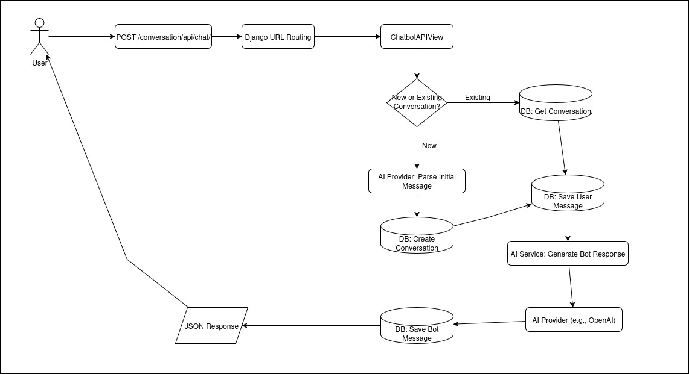
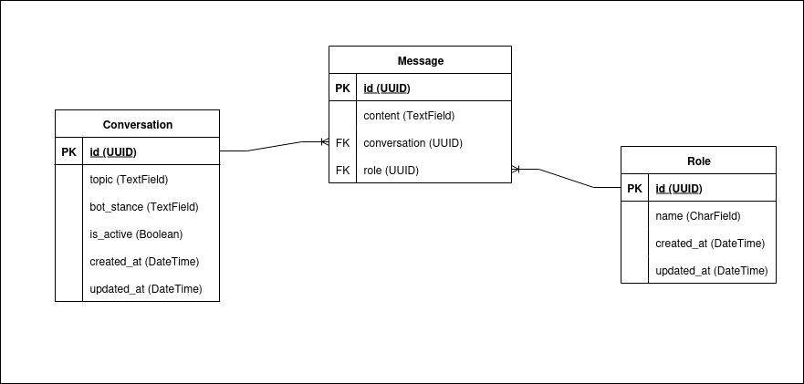

# Kopi Challenge - Tactical Empathy Debate Bot

A Django-based API service that powers a persuasive debate chatbot capable of maintaining and defending any given position through tactical empathy and strategic argumentation.

## 🚀 Project Overview

This project implements a debate chatbot API that can:

  - Start new conversations on any debate topic.
  - Take and defend an assigned stance, no matter how controversial.
  - Maintain coherent, persuasive arguments across multiple message exchanges.
  - Store conversation history and maintain context in a PostgreSQL database.
  - Use a flexible AI provider system, with OpenAI as the primary implementation.

## 🌐 Live Demo & Testing

You can test a live version of this application, including the web interface and the AI provider connectivity tests, at the following URL:

**[https://kopi-challenge.rgrox.com](https://kopi-challenge.rgrox.com)**

## 🏗️ Architecture

The application is a containerized Django service built around a clear, decoupled architecture. The core logic is separated into distinct modules for handling API requests, generating AI responses, and interacting with the database.

### Request Flow

The following flowchart illustrates the complete request-response lifecycle, from the moment a user sends a message to when they receive the bot's reply. It visualizes the journey of data through the Django views, AI services, and database.



### Data Model

The database schema is designed to efficiently store and manage conversations. The Entity-Relationship (ER) diagram below shows the three main tables: `Conversation`, `Message`, and `Role`, along with their fields and relationships. This structure allows for clear tracking of each debate's topic, the bot's stance, and the full history of exchanges.



### Technology Stack

  - **Backend**: Django 4.2
  - **Database**: PostgreSQL 16
  - **AI Integration**: OpenAI
  - **Containerization**: Docker and Docker Compose
  - **Web Server**: Gunicorn with WhiteNoise for static files.

## ⚡ Quick Start

### Prerequisites

  - Docker and Docker Compose
  - Make (for build commands)
  - An API key for an AI provider (e.g., OpenAI)

### Setup

1.  Clone the repository.
2.  Copy `env.example` to `.env` and configure your settings, including your AI provider API key.
3.  Run the application using Make:

<!-- end list -->

```bash
# Check dependencies and environment
make install

# Build and start all services in detached mode
make run
```

The API will be available at `http://localhost:8000/conversation/api/chat/`.

## 🔌 API Interface

### Endpoint

```
POST /conversation/api/chat/
```

### Request Body

| Field | Type | Description |
| :--- | :--- | :--- |
| `conversation_id` | `string` | `null` | The UUID of the conversation. Use `null` to start a new debate. |
| `message` | `string` | The user's message. |

### Success Response (200 OK)

```json
{
    "conversation_id": "a1b2c3d4-e5f6-7890-1234-567890abcdef",
    "message": [
        {
            "role": "user",
            "message": "Your most recent message."
        },
        {
            "role": "bot", 
            "message": "The bot's new response."
        }
    ]
}
```

## ⚙️ Development

### Available Make Commands

The `Makefile` provides convenient commands for managing the project:

  - `make help`: Show all available commands.
  - `make install`: Check dependencies and environment setup.
  - `make run`: Start all services with Docker Compose.
  - `make down`: Stop all running services.
  - `make clean`: Stop and remove all containers, networks, and volumes.
  - `make test`: Run the Django test suite.
  - `make logs`: Follow the logs from the services.
  - `make shell`: Open a bash shell inside the application container.

### Testing

The project includes a comprehensive test suite that covers API endpoints, database models, and AI service logic.

```bash
make test
```