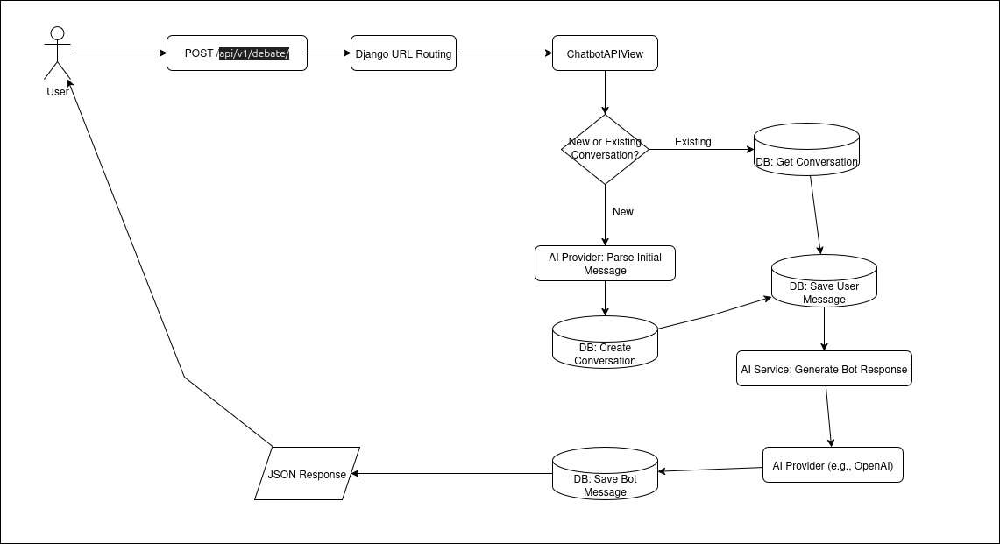

# Kopi Challenge - Tactical Empathy Debate Bot

A Django-based API service that powers a persuasive debate chatbot capable of maintaining and defending any given position through tactical empathy and strategic argumentation.

## 🚀 Project Overview

This project implements a debate chatbot API that can:

  - Start new conversations on any debate topic.
  - Take and defend an assigned stance, no matter how controversial.
  - Maintain coherent, persuasive arguments across multiple message exchanges.
  - Store conversation history and maintain context in a PostgreSQL database.
  - Use a flexible AI provider system, with OpenAI as the primary implementation.

## 🌐 Live Demo & Testing

You can test a live version of this application, including the web interface and the AI provider connectivity tests, at the following URL:

**[https://kopi-challenge.rgrox.com](https://kopi-challenge.rgrox.com)**

## 🏗️ Architecture

The application is a containerized Django service built around a clear, decoupled architecture. The core logic is separated into distinct modules for handling API requests, generating AI responses, and interacting with the database.

### Request Flow

The following flowchart illustrates the complete request-response lifecycle, from the moment a user sends a message to when they receive the bot's reply. It visualizes the journey of data through the Django views, AI services, and database.



### Data Model

The database schema is designed to efficiently store and manage conversations. The Entity-Relationship (ER) diagram below shows the three main tables: `Conversation`, `Message`, and `Role`, along with their fields and relationships. This structure allows for clear tracking of each debate's topic, the bot's stance, and the full history of exchanges.


### Technology Stack

  - **Backend**: Django 4.2
  - **Database**: PostgreSQL 16
  - **AI Integration**: OpenAI
  - **Containerization**: Docker and Docker Compose
  - **Web Server**: Gunicorn with WhiteNoise for static files.

## ⚡ Quick Start

### Prerequisites

  - Docker and Docker Compose
  - Make (for build commands)
  - An API key for an AI provider (e.g., OpenAI)

### Setup

1.  Clone the repository.
2.  Copy `env.example` to `.env` and configure your settings, including your AI provider API key.
3.  Run the application using Make:

<!-- end list -->

```bash
# Check dependencies and environment
make install

# Build and start all services in detached mode
make run
```

The API will be available at `http://localhost:8000/api/v1/debate/`.

### Web Interface

The application also provides a web interface for testing and interacting with the debate bot. Once the services are running, you can access the main web interface at:

```
http://localhost:8000/conversation/
```

## 🔌 API Interface

The application provides a comprehensive REST API for managing debates and conversations.

### Main Debate Endpoint

```
POST /api/v1/debate/
```

#### Request Body

| Field | Type | Description |
| :--- | :--- | :--- |
| `conversation_id` | `string` \| `null` | The UUID of the conversation. Use `null` to start a new debate. |
| `user_message` | `string` | The user's message. |

#### Success Response (200 OK)

```json
{
    "conversation_id": "a1b2c3d4-e5f6-7890-1234-567890abcdef",
    "user_message": "I think climate change is serious",
    "messages": [
        {
            "id": "msg-uuid",
            "role_name": "user",
            "content": "I think climate change is serious",
            "created_at": "2025-09-14T05:00:00Z",
            "conversation_id": "a1b2c3d4-e5f6-7890-1234-567890abcdef"
        },
        {
            "id": "msg-uuid-2", 
            "role_name": "bot",
            "content": "Climate change is actually overblown by the media...",
            "created_at": "2025-09-14T05:00:01Z",
            "conversation_id": "a1b2c3d4-e5f6-7890-1234-567890abcdef"
        }
    ]
}
```

### Additional Endpoints

- `GET /api/v1/conversation/` - List all conversations
- `GET /api/v1/conversation/{id}/` - Get specific conversation details
- `PUT /api/v1/conversation/{id}/` - Update conversation
- `DELETE /api/v1/conversation/{id}/` - Delete conversation
- `GET /api/v1/debate/{conversation_id}/` - Get debate messages for a conversation
- `GET /api/v1/messages/{message_id}/` - Get specific message
- `POST /api/v1/messages/` - Create new message

### API Documentation

Interactive API documentation is available at:
- **Swagger UI**: `http://localhost:8000/api/v1/redoc/`
- **OpenAPI Schema**: `http://localhost:8000/api/v1/schema/`

## ⚙️ Development

### Available Make Commands

The `Makefile` provides convenient commands for managing the project:

  - `make help`: Show all available commands.
  - `make install`: Check dependencies and environment setup.
  - `make run`: Start all services with Docker Compose.
  - `make down`: Stop all running services.
  - `make clean`: Stop and remove all containers, networks, and volumes.
  - `make test`: Run the Django test suite.
  - `make logs`: Follow the logs from the services.
  - `make shell`: Open a bash shell inside the application container.

### Testing

The project includes a comprehensive test suite that covers API endpoints, database models, and AI service logic.

#### Running Tests

The project provides multiple testing options:

**Basic Tests (No API Key Required)**
```bash
make test-offline
```
Runs model and view tests without requiring OpenAI API access.

**Full Test Suite (API Key Required)**
```bash
make test
# or
make test-full
```
Runs all tests including AI integration tests. Requires `OPENAI_API_KEY` in your `.env` file.

#### Test Coverage

The test suite includes:
- **Model Tests**: Database model validation and relationships ✅
- **Web Interface Tests**: Template rendering and view logic ✅  
- **API Endpoint Tests**: Full request/response cycle testing for debate endpoints
- **AI Service Tests**: AI provider functionality (requires API key)
- **Error Handling Tests**: Invalid input and edge case scenarios ✅

**Note**: AI integration tests currently require a valid OpenAI API key. The `test-offline` command runs all tests that don't require external API calls, making it perfect for CI/CD environments and local development without API keys.

## 🔄 Recent Updates

### September 2025 Updates

- **✅ Enhanced Testing Framework**: Added `make test-offline` command for running tests without API key requirements
- **✅ Improved Make Commands**: Updated Makefile with better error handling and clearer command descriptions
- **✅ API Documentation**: Added comprehensive API documentation with interactive Swagger UI
- **✅ Test Coverage**: Separated tests into offline-capable (models, views) and API-dependent (AI integration) categories
- **✅ Developer Experience**: Improved setup process with better environment validation and error messages

### Current Status

The application is fully functional with:
- ✅ Complete REST API for debate management
- ✅ Web interface for interactive testing
- ✅ PostgreSQL database with proper migrations
- ✅ Docker containerization for easy deployment
- ✅ Comprehensive test suite (6/14 tests run offline, 14/14 with API key)
- ✅ Live demo available at [kopi-challenge.rgrox.com](https://kopi-challenge.rgrox.com)